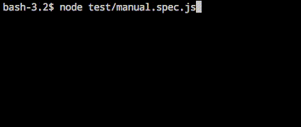

# listr-work-queue

> Drop-in [`Listr`](https://github.com/SamVerschueren/listr) subclass for tasks that need to be picked from a queue concurrently



------

:information_source: *About this package*

*The main difference with the standard `concurrent: <count>` option is that tasks are only rendered as they get picked up, and disappear once processed.*

*This package will not be necessary anymore if the following `Listr` feature request is implemented: [#53 Display only the task that is running](https://github.com/SamVerschueren/listr/issues/53).
When it is, we can simply rely on the `concurrent: <count>` option and let Listr look after the scheduling / execution of the tasks.*

------


## Usage

```bash
npm install listr-work-queue --save
```

```js
const Listr = require('listr')
const ListrWorkQueue = require('listr-work-queue')

const tasks = new Listr([{
  title: 'Running jobs',
  task: () => new ListrWorkQueue(/* tasks */, {
    concurrent: WORKER_COUNT,
    exitOnError: false
  })
}])

tasks.run().then(() => console.log('Done'))
```

Refer to the [manual test case](test/manual.spec.js) for a full working example.

## Jobs

Every job is an object with 2 properties, similar to the standard `Listr` tasks. The `task` property **must** be a Promise. Observables and streams are not supported.

```js
{
  title: 'Job A',
  task: () => new Promise(resolve => setTimeout(resolve, 1000))
}
```

## Options

- `concurrent`: the number of workers getting tasks from the queue.

```js
{
	concurrent: os.cpus().length
}
```

- `exitOnError`: whether to stop processing new jobs when one of the jobs fails (default is `true`). Note that pending tasks will still complete before the process is stopped.

```js
{
	exitOnError: false
}
```

- `update()`: a callback to report on the overall progress. This can be used for example to update the parent task title.

```js
{
  title: 'Running jobs',
  task: (ctx, parent) => new ListrWorkQueue(/* tasks */, {
    update: (completed, total) => {
      parent.title = `Running jobs (${completed}/${total})`
    }
  })
}
```
